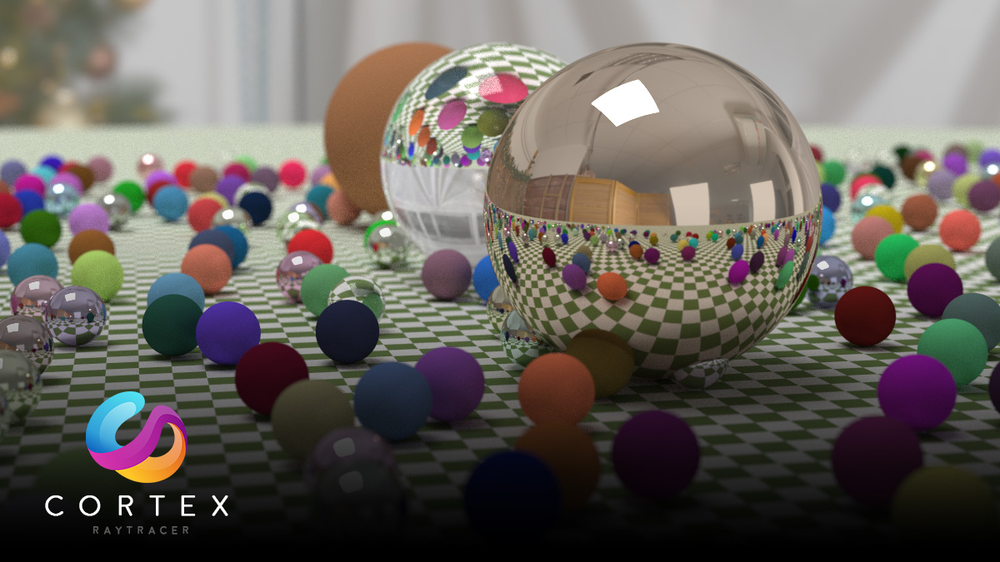
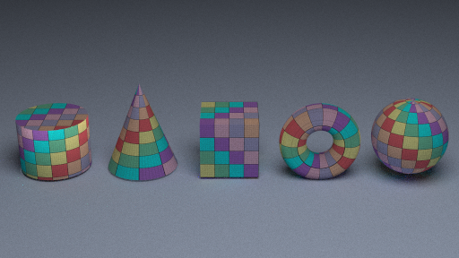
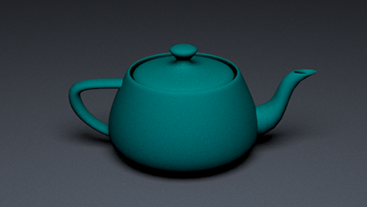
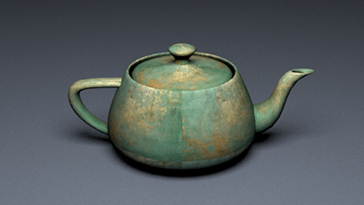
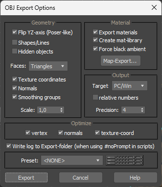
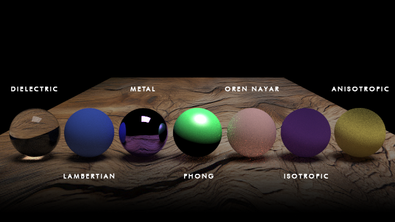
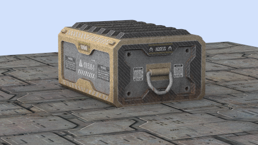
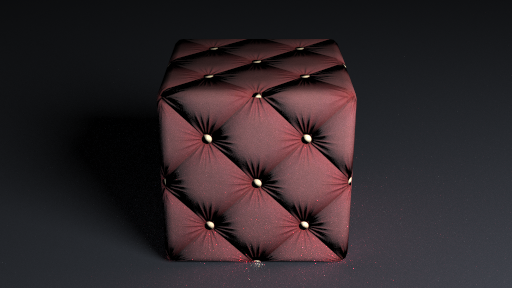
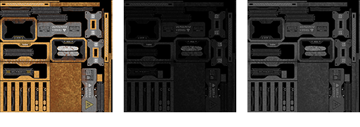
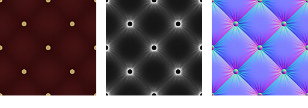

# Cortex-Raytracer

Cortex RT is a self made CPU based monte carlo path tracer created from scratch.




# Primitives

Cortex supports an extended list of builtin uv mapped primitives mostly for testing purposes :
- Plane
- Cylinder
- Disk
- Cone
- Box
- Torus
- Sphere




# Meshes

Cortex RT supports loading Wavefront .obj files.

obj is a kind of old legacy plain text 3D file format but it is still widely used by 3D software (blender, 3ds max, maya...) as an export file format.
- .obj file contains vertex, faces, normals, uv mapping and smmothing groups definition
- .mtl (Material template library) additional file contains materials definition (color, textures, ambient, diffuse, specular, bump...)

If you want to knowm more about obj and mtl files : https://en.wikipedia.org/wiki/Wavefront_.obj_file


teapot.obj solid color | teapot.obj textured | 3ds max obj exporter
--- | --- | ---
 |  | 


# Scenes

Cortex RT comes with a convenient .scene configuration file system to describe the scene to be rendered (primitives, meshes, camera, lights, materials, textures, rendering quality...)

```
# teapot_mesh.scene

image:
{
    width = 512;
    height = 388;
    maxDepth = 100;
    samplesPerPixel = 100;
    background = 
    {
        color = { r = 0.0; g = 0.0; b = 0.0; };
    };
};

# Configuration of the camera
camera:
{
    aspectRatio = "16:9";
    lookFrom = { x = 0.0; y = 4.0; z = 9.0; };
    lookAt = { x = 0.0; y = 0.0; z = 0.0; };
    upAxis = { x = 0.0; y = 1.0; z = 0.0; };
    fov = 18.0;
};

# Lights in the scene
lights:
{
    sphereLights: (
        {
            name = "MySphereLight";
            position = { x = 0.0; y = 8.0; z = 5.0; };
            radius = 3.0;
            intensity = 3.0;
            color = { r = 1.0; g = 1.0; b = 1.0; };
            invisible = true;
        }
    )
}

textures:
{
    solidColor: (
        {
            name = "ground_texture";
            color = { r = 0.7; g = 0.8; b = 1.0; };
        },
    ),
    image: (
        {
            name = "teapot_diffuse_texture";
            filepath = "../../data/models/rusted_metal1.jpg";
        }
    )
}

materials:
{
    lambertian: (
        {
            name = "ground_material";
            texture = "ground_texture";
        }
    ),
    phong: (
        {
            name = "teapot_material";
            diffuseTexture = "teapot_diffuse_texture";
            ambientColor = { r = 0.0; g = 0.0; b = 0.0; };
            shininess = 0.9;
        }
    )
}

# Meshes in the scene
meshes:
{
    obj: (
        {
            name = "MyTeapotModel"
            filepath = "../../data/models/teapot.obj";
            position = { x = 0.0; y = 0.0; z = 0.0; };
            material = "teapot_material"
            use_mtl = false;
            use_smoothing = true;
            transform =
            {
                translate = { x = 0.0; y = 0.0; z = 0.0; };
                rotate = { x = 0.0; y = 0.0; z = 0.0; };
                scale = { x = 0.02; y = 0.02; z = 0.02; };
            };
        }
    );
};

# Primitives in the scene
primitives:
{
    # List of boxes
    boxes: (
        {
            name = "MyGround";
            position = { x = 0.0; y = -1.0; z = 0.0; };
            size = { x = 40.0; y = 0.5; z = 40.0; };
            material = "ground_material";
            uvmapping = { scale_u = 1.0; scale_v = 1.0; offset_u = 0.0; offset_v = 0.0; repeat_u = 2.0; repeat_v = 2.0; };
        }
    );
};
```

# Materials



Cortex RT mostly support following materials :
- Phong
- Oren Nayar
- Anisotropic (for wood, slate, ice, velvet...)
- Isotropic (for glass, crystals with cubic symmetry, diamonds, plastic, metal...)
- Dielectric (for water, glass, diamond...)
- Lambertian (simple diffuse material without any specular relection)
- Metal (for metals, mirrors...)
- Emissive

crate.obj (diffuse + specular + bump textures) | cushion.obj (diffuse + specular + normal textures)
--- | ---
 | 
 | 

The phong reflection model is a full featured material that combines ambient + diffuse + specular.
https://en.wikipedia.org/wiki/Phong_reflection_model

On top of that, Cortex RT phong material also support a lot of possible textures (solid color, gradient, image, bump, normal, displacement, alpha...)

```
# Sample materials section in scene file
materials:
{
    lambertian: (
        {
            name = "ground_material";
            texture = "ground_texture";
        }
    ),
    phong: (
        {
            name = "crate_material";
            diffuseTexture = "crate_diffuse_texture";
            specularTexture = "crate_specular_texture";
            #bumpTexture = "crate_bump_texture";
            normalTexture = "crate_normal_texture";
            ambientColor = { r = 0.0; g = 0.0; b = 0.0; };
            shininess = 0.0;
        }
    )
}
```

# Textures

Cortex RT supports quite a lot of textures you can combine in a material :

- Solid color texture
- Gradient color texture
- Image texture
- Bump texture
- Normal texture
- Displacement texture
- Alpha texture (transparency texture)
- Perlin texture (procedural noise)
- Checker (procedural checkboard pattern texture)
- Emissive texture

```
# Sample textures section in scene file
textures:
{
    image: (
        {
            name = "ground_texture";
            filepath = "../../data/textures/scifi_floor2.png";
        },
        {
            name = "crate_diffuse_texture";
            filepath = "../../data/models/crate_diffuse.jpg";
        },
        {
            name = "crate_specular_texture";
            filepath = "../../data/models/crate_specular.jpg";
        },
        {
            name = "crate_bump_texture";
            filepath = "../../data/models/crate_bump.jpg";
        }
    ),
    normal: (
        {
            name = "crate_normal_texture";
            filepath = "../../data/models/crate_normal.jpg";
            strength = 0.005;
        }
    )
}
```

# Camera

# Background

# Image settings

# Lights

# Transforms

# Groups

# Rendering parameters

# Anti aliasing

# Performances and optimizations

# Command line exe

# Graphical User Interface

# Dependencies

# Thanks to

# What's next ?


