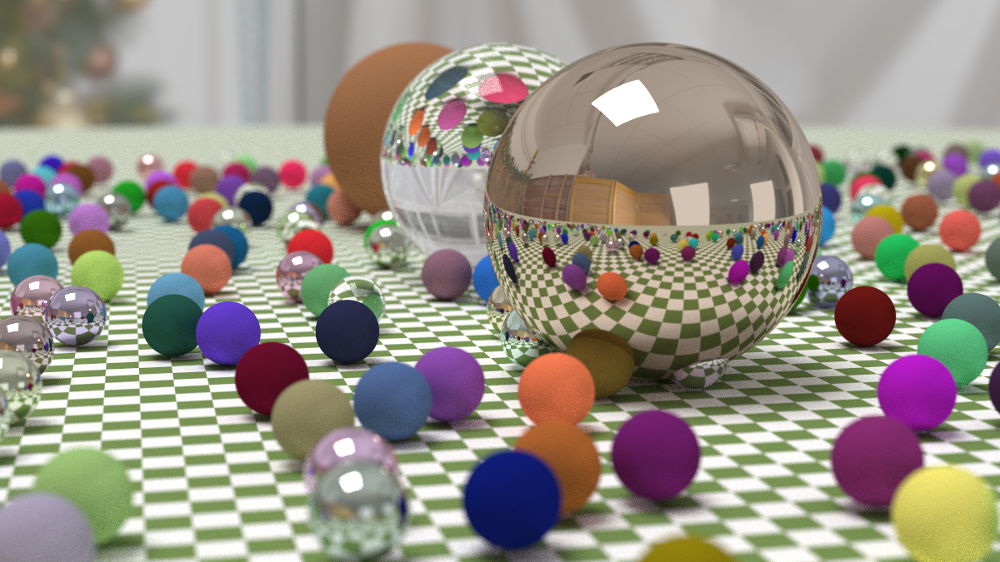

# Cortex-Raytracer

Cortex RT is a self made CPU based monte carlo path tracer created from scratch.

## Primitives

Cortex supports an extended list of builtin uv mapped primitives mostly for testing purposes :
- Sphere
- Box
- Plane
- Cylinder
- Cone
- Torus
- Disk

## Meshes

Cortex supports loading Wavefront .obj files
obj is a kind of old plain text 3D file format but it is still widely used by 3D software (blender, 3ds max, maya...) as an export file format.
- .obj file contains vertex, faces, normals, uv mapping and smmothing groups
- .mtl (Material template library) file contains materials description (ambient, diffuse, specular, bump...) 
If you want to knowm more about obj and mtl files : https://en.wikipedia.org/wiki/Wavefront_.obj_file

## Scenes

## Materials

## Textures

## Lights

## Transforms

## Groups

## Performances and optimizations

## Dependencies

## Thanks to

## What's next ?

