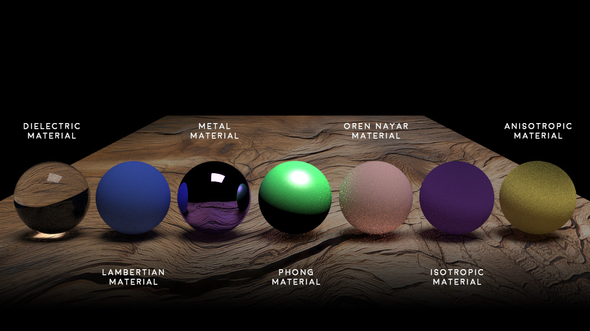
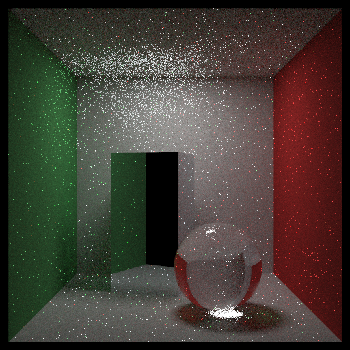
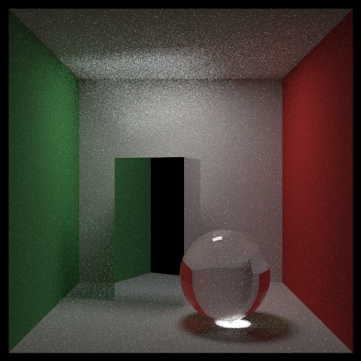

# Cortex-Raytracer

Cortex RT is a self made CPU based monte carlo path tracer created from scratch in C++.
This project is open source and any one can contribute to help me improving it.


# Primitives

Cortex supports an extended list of builtin uv mapped primitives mostly for testing purposes :
- Plane
- Cylinder
- Disk
- Cone
- Box
- Torus
- Sphere


Primitives with test UV texture | Primitives with stone texture
--- | ---
 | 


[extended_primitives.scene](https://github.com/flarive/Cortex-Raytracer/tree/main/data/scenes/extended_primitives.scene)


# Meshes

Cortex RT supports loading Wavefront .obj files.

obj is a kind of old legacy plain text 3D file format but it is still widely used by 3D software (blender, 3ds max, maya...) as an export file format.
- .obj file contains vertex, faces, normals, uv mapping and smmothing groups definition
- .mtl (Material template library) additional file contains materials definition (color, textures, ambient, diffuse, specular, bump...)

If you want to knowm more about obj and mtl files : https://en.wikipedia.org/wiki/Wavefront_.obj_file


teapot.obj solid color | teapot.obj textured | 3ds max obj exporter
--- | --- | ---
 |  | 


# Scenes

Cortex RT comes with a convenient .scene configuration file system to describe the scene to be rendered (primitives, meshes, camera, lights, materials, textures, rendering quality...)

```
# teapot_mesh.scene

image:
{
    width = 512;
    height = 388;
    maxDepth = 100;
    samplesPerPixel = 100;
    background = 
    {
        color = { r = 0.0; g = 0.0; b = 0.0; };
    };
};

# Configuration of the camera
camera:
{
    aspectRatio = "16:9";
    lookFrom = { x = 0.0; y = 4.0; z = 9.0; };
    lookAt = { x = 0.0; y = 0.0; z = 0.0; };
    upAxis = { x = 0.0; y = 1.0; z = 0.0; };
    fov = 18.0;
};

# Lights in the scene
lights:
{
    sphereLights: (
        {
            name = "MySphereLight";
            position = { x = 0.0; y = 8.0; z = 5.0; };
            radius = 3.0;
            intensity = 3.0;
            color = { r = 1.0; g = 1.0; b = 1.0; };
            invisible = true;
        }
    )
}

textures:
{
    solidColor: (
        {
            name = "ground_texture";
            color = { r = 0.7; g = 0.8; b = 1.0; };
        },
    ),
    image: (
        {
            name = "teapot_diffuse_texture";
            filepath = "../../data/models/rusted_metal1.jpg";
        }
    )
}

materials:
{
    lambertian: (
        {
            name = "ground_material";
            texture = "ground_texture";
        }
    ),
    phong: (
        {
            name = "teapot_material";
            diffuseTexture = "teapot_diffuse_texture";
            ambientColor = { r = 0.0; g = 0.0; b = 0.0; };
            shininess = 0.9;
        }
    )
}

# Meshes in the scene
meshes:
{
    obj: (
        {
            name = "MyTeapotModel"
            filepath = "../../data/models/teapot.obj";
            position = { x = 0.0; y = 0.0; z = 0.0; };
            material = "teapot_material"
            use_mtl = false;
            use_smoothing = true;
            transform =
            {
                translate = { x = 0.0; y = 0.0; z = 0.0; };
                rotate = { x = 0.0; y = 0.0; z = 0.0; };
                scale = { x = 0.02; y = 0.02; z = 0.02; };
            };
        }
    );
};

# Primitives in the scene
primitives:
{
    # List of boxes
    boxes: (
        {
            name = "MyGround";
            position = { x = 0.0; y = -1.0; z = 0.0; };
            size = { x = 40.0; y = 0.5; z = 40.0; };
            material = "ground_material";
            uvmapping = { scale_u = 1.0; scale_v = 1.0; offset_u = 0.0; offset_v = 0.0; repeat_u = 2.0; repeat_v = 2.0; };
        }
    );
};
```

# Materials



Cortex RT mostly support following materials :
- Phong
- Oren Nayar
- Anisotropic (for wood, slate, ice, velvet...)
- Isotropic (for glass, crystals with cubic symmetry, diamonds, plastic, metal...)
- Dielectric (for water, glass, diamond...)
- Lambertian (simple diffuse material without any specular relection)
- Metal (for metals, mirrors...)
- Emissive (WIP)

crate.obj (diffuse + specular + bump textures) | cushion.obj (diffuse + specular + normal textures)
--- | ---
 | 
 | 

The phong reflection model is a full featured material that combines ambient + diffuse + specular.
https://en.wikipedia.org/wiki/Phong_reflection_model

On top of that, Cortex RT phong material also support a lot of possible textures (solid color, gradient, image, bump, normal, displacement, alpha...)

```
# Sample materials section in scene file
materials:
{
    lambertian: (
        {
            name = "ground_material";
            texture = "ground_texture";
        }
    ),
    phong: (
        {
            name = "crate_material";
            diffuseTexture = "crate_diffuse_texture";
            specularTexture = "crate_specular_texture";
            #bumpTexture = "crate_bump_texture";
            normalTexture = "crate_normal_texture";
            ambientColor = { r = 0.0; g = 0.0; b = 0.0; };
            shininess = 0.0;
        }
    )
}
```
[all_materials_spheres.scene](https://github.com/flarive/Cortex-Raytracer/tree/main/data/scenes/all_materials_spheres.scene)

Several kinds of glasses :


[material_glass_basic.scene](https://github.com/flarive/Cortex-Raytracer/tree/main/data/scenes/material_glass_basic.scene)


[material_glass_textures.scene](https://github.com/flarive/Cortex-Raytracer/tree/main/data/scenes/material_glass_textures.scene)

Several kinds of metals :


[material_metal_basic.scene](https://github.com/flarive/Cortex-Raytracer/tree/main/data/scenes/material_metal_basic.scene)


[material_metal_textures.scene](https://github.com/flarive/Cortex-Raytracer/tree/main/data/scenes/material_metal_textures.scene)

# Textures


Cortex RT supports quite a lot of textures you can combine in a material :

- Solid color texture
- Gradient color texture
- Image texture
- Bump texture
- Normal texture
- Displacement texture (WIP)
- Alpha texture (transparency texture)
- Perlin texture (procedural noise)
- Checker (procedural checkboard pattern texture)
- Emissive texture (WIP)

```
# Sample textures section in scene file
textures:
{
    image: (
        {
            name = "ground_texture";
            filepath = "../../data/textures/scifi_floor2.png";
        },
        {
            name = "crate_diffuse_texture";
            filepath = "../../data/models/crate_diffuse.jpg";
        },
        {
            name = "crate_specular_texture";
            filepath = "../../data/models/crate_specular.jpg";
        },
        {
            name = "crate_bump_texture";
            filepath = "../../data/models/crate_bump.jpg";
        }
    ),
    normal: (
        {
            name = "crate_normal_texture";
            filepath = "../../data/models/crate_normal.jpg";
            strength = 0.005;
        }
    )
}
```

[all_textures_spheres.scene](https://github.com/flarive/Cortex-Raytracer/tree/main/data/scenes/all_textures_spheres.scene)


Bump texture | Normal texture
--- | ---
 | 


# Camera

Cortex RT provides 2 kinds of camera : perspective (default) and orthographic (no perception of depth)

Perspective camera | Orthographic camera
--- | ---
 | 

```
# Configuration of a perspective camera
camera:
{
    aspectRatio = "16:9";
    lookFrom = { x = 0.0; y = 2.0; z = 9.0; };
    lookAt = { x = 0.0; y = 0.6; z = 0.0; };
    upAxis = { x = 0.0; y = 1.0; z = 0.0; };
    fov = 18.0; // Field Of View (zoom level in degrees)
};
```

```
# Configuration of an orthographic camera
camera:
{
    aspectRatio = "16:9";
    lookFrom = { x = 0.0; y = 2.0; z = 9.0; };
    lookAt = { x = 0.0; y = 0.6; z = 0.0; };
    upAxis = { x = 0.0; y = 1.0; z = 0.0; };
    orthographic = true;
    orthoHeight = 2.0; // Orthographic viewport height (height of the viewport in world space units)
};
```


# Rendering parameters

The image section in .scene files defines some usefull render settings :

- width/height : The size in pixels of the final rendered image (according to the camera aspect ratio)
- maxDepth : The max number of ray bounces (50 should be more than enough)
- samplesPerPixel (spp) : The max number of samples calculated to generate each pixel of the rendered image (50 is very fast but very noisy, 500-1000 is high quality, 5000+ is extra high quality but very slow)
- background : The background to use while rendering the scene (color, simple image or hdr skybox image)

```
# Configuration of the rendered image quality
image:
{
    width = 512;
    height = 388;
    maxDepth = 50;
    samplesPerPixel = 500;
    background = 
    {
        #color = { r = 0.1; g = 0.1; b = 0.1; };
        filepath = "../../data/backgrounds/hdr/christmas_photo_studio_02_2k.hdr";
        is_skybox = true;
    };
};
```

50 spp | 500 spp | 1000 spp | 5000 spp | 10000 spp
--- | --- | --- | --- | ---
 |  |  |  | 


# Lights

Cortex RT supports 3 different kinds of lights :

- Omni light : 
Also known as a point light, an omni light emits light equally in all directions from a single point in space, similar to a light bulb.

- Directional light : 
Simulates light coming from a specific direction, as if it were emitted from an infinitely large source, such as the sun.

- Spot light : 
More focused light source that emits light in a specific direction within a cone.


Lights are produced by hidden objects (quad or sphere) with an emissive material.\
Such objects can be displayed for debug lightning purpose.

Omni light | Omni light debug (emissive sphere)
--- | ---
 | 

Directional light | Directional light debug (emissive quad)
--- | ---
 | 

Spot light | Spot light debug (emissive sphere)
--- | ---
 | 

[all_lights_types.scene](https://github.com/flarive/Cortex-Raytracer/tree/main/data/scenes/all_lights_types.scene)


# Transforms and groups

Cortex RT supports applying transforms to primitives and meshes (translate, rotate, scale).
Transform attribute overrides the object position and size already defined.

```
# Transform applied on a box primitive
primitives:
{
    boxes: (
        {
            name = "MyGround";
            position = { x = 0.0; y = -0.28; z = 0.0; };
            size = { x = 10.0; y = 0.5; z = 40.0; };
            material = "ground_material";
        },
        {
            name = "MyBox"
            position = { x = 0.0; y = 0.35; z = 0.0; };
            size = { x = 0.7; y = 0.7; z = 0.7; };
            material = "uvmapper_material";
            uvmapping = { scale_u = 0.5; scale_v = 0.5; offset_u = 0.0; offset_v = 0.0; };
            transform =
            {
                translate = { x = 0.0; y = 0.0; z = 0.0; };
                rotate = { x = 0.0; y = 45.0; z = 0.0; };
                scale = { x = 2.0; y = 2.0; z = 2.0; };
            };
        }
    );
};

# Transform applied on a custom mesh
meshes:
{
    obj: (
        {
            name = "MyMesh"
            filepath = "../../data/models/smooth_sphere.obj";
            use_mtl = true;
            use_smoothing = true;
            transform =
            {
                translate = { x = -1.3; y = 0.0; z = 0.0; };
                rotate = { x = 0.0; y = 45.0; z = 0.0; };
                scale = { x = 1.2; y = 1.2; z = 1.2; };
            };
        }
    );
};
```

In a scene objects (primitives and meshes) can be grouped by using groups.
A transform can also be applied to a group.

```
primitives:
{
    boxes: (
        {
            name = "MyBox1"
            position = { x = 0.0; y = 0.0; z = 0.0; };
            size = { x = 0.7; y = 0.7; z = 0.7; };
            material = "uvmapper_material";
            group = "MyGroup";
        },
        {
            name = "MyBox2"
            position = { x = 0.0; y = 0.0; z = 0.0; };
            size = { x = 0.7; y = 0.7; z = 0.7; };
            material = "uvmapper_material";
            group = "MyGroup";
        }
    );
};

# Definition of groups
groups: (
    {
        name = "MyGroup";
        transform =
        {
            translate = { x = -100.0; y = 270.0; z = 395.0; };
            rotate = { x = 0.0; y = 15.0; z = 0.0; };
            scale = { x = 2.0; y = 2.0; z = 2.0; };
        };
    }
);
```

[transforms.scene](https://github.com/flarive/Cortex-Raytracer/tree/main/data/scenes/transforms.scene)


# Anti aliasing

# Performances and optimizations


# Graphical User Interface

CortexRT also comes with a GUI (CortexRT.exe) to easily adjust parameters and have a preview of a the rendered image.


# Rendering pipeline

CortexRT rendering pipeline is composed by :
- Raytracing pass
- Denoiser pass
- Post processing pass

The CortexUI helps chaining easily the different passes to produce the final output image.

# Raytracer command line

CortexRT is a lightweight standalone executable (CortexRTCore.exe) that can be called with command line arguments :

```
CortexRTCore.exe -width 512 -height 512 -ratio 1:1 -spp 250 -maxdepth 50 -gamma 1 -aa 1 -mode 8
-scene ..\..\data\scenes\buddha1_mesh.scene
-save ..\..\data\renders\buddha1_mesh.png
```

Argument | Type | Explanations
--- | --- | ---
width | int | width in pixels of the output
height | int | height in pixels of the output
ratio | string | image ratio of the output (ex : 16:9, 9:16, 1:1...)
spp | int | number of sample per pixel (50 and less = fast but low quality with a lot of noise, between 100 and 250 is a good quality/time compromise, 500 and more = slower but high quality with very few noise)
maxdepth | int | maximum number of bounce for a ray (you shouldn't need to change this value)
gamma | boolean int | apply gamma correction to the output (0 = no correction, 1 = gamma correction)
aa | int | anti aliasing method (0 = no anti aliasing, 1 = random method (fast), 2 = msaa (slower))
mode | int | number of CPU core to use for multithreaded rendering (0 = mono threaded, 2 = multi threaded with 2 cores, 8 = 8 cores and so on...)
scene | string | relative or absolute path to the .scene file to render
save | string | relative or absolute path to the rendered output


# Denoiser command line

If you want to apply a denoising pass (CortexRTDenoiser.exe) after rendering, you can call it like that :

```
CortexRTDenoiser.exe -input ..\..\data\renders\buddha1_mesh.png -output ..\..\data\renders\buddha1_mesh_denoised.png -hdr 0
```

# Post Processing command line

If you want to apply a post process (filters) pass (CortexRTDenoiser.exe) after rendering, you can call it like that :

```
CortexRTPostProcess.exe -input ..\data\renders\cornell_box.png -output .\data\renders\cornell_box_fx.png -effect 5
```

Supported post processing filters (effects) :

Index | Name | Explanations
--- | --- | ---
0 | None | Add no filter to the render 
1 | Bloom | Add a bloom/glow effect to the render
2 | Denoise | WIP / for test purpose
3 | Contrast Saturation Brightness | Adjust the contrast, the saturation and the brightness of the render
4 | Floyd Steinberg dithering | Transform to black and white dithered render
5 | Toon | WIP / Transform to cartoon render (cell shader)

Post process filters are using GLSL shaders and are running on GPU.


# Supported platforms

CortexRT is using mostly std and modern C++ (compiled for C++ 20) but is limited to Windows platform for the moment.
With few changes it should be possible to compile for mac or linux (I will see later).


# Dependencies

CortexRT is using following libs :

- [GLM](https://github.com/g-truc/glm) (OpenGL Mathematics)
- [Eigen](https://eigen.tuxfamily.org/index.php?title=Main_Page) (for linear algebra)
- [LibConfig](https://github.com/hyperrealm/libconfig) (for parsing .scene files)
- [TinyObjLoader](https://github.com/tinyobjloader/tinyobjloader) (for loading .obj 3D models)
- [PCG](https://github.com/imneme/pcg-cpp) (for high quality random number generation)
- [stb](https://github.com/nothings/stb) (for loading/saving images)
- [Oidn](https://github.com/RenderKit/oidn) (Intel Open Image Denoiser)
- [imGUI](https://github.com/ocornut/imgui) (well known UI lib)
- [GLFW](https://www.glfw.org) (multi-platform library for OpenGL)

# Thanks to

Following sites and people helped a lot to create Cortex Raytracer :

- [Ray Tracing in One Weekend](https://raytracing.github.io) by Peter Shirley, Trevor David Black, Steve Hollasch, everything started from here :)
- [Scratchapixel](https://www.scratchapixel.com) for their good articles

- [NickSpyker](https://github.com/NickSpyker/RayTracer) for inspiring me to start this project
- [KDridi](https://github.com/kdridi/raytracer) for listening to me and helping me to solve problems


# Gallery


# What's next ?


